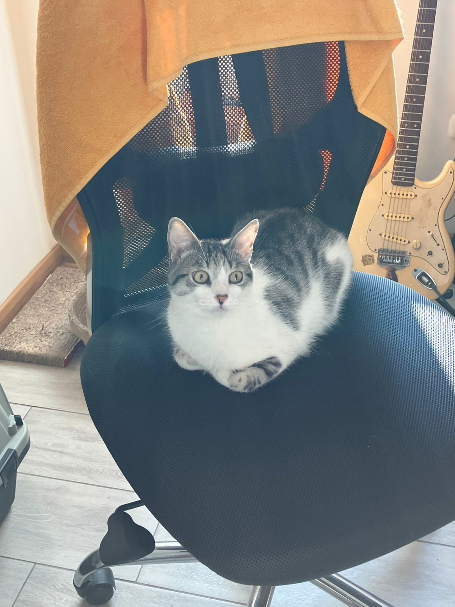

This is a "new" blog section. I plan to write about ML systems, Julia, videogames, and
personal reflection. In the past, I removed this entire part because I didn't have enough
time to write, but at the same time I didn't have the motivation to write.

Right now, my life has changed a lot and the spark of writing has returned: all thanks to
my new habits (note-taking, journaling, and reading). I'm not taking it like
for an entire year, but I think it's totally worth it to write at least once a week.
Later I'm going to write about this specific new habit.

I know that these notes are not going to be very polished, or publicly known, but in the
future I'm sure that I will read them and remember how I felt at this moment. That's the
most important about writing: to remember and reflect on your own life.

