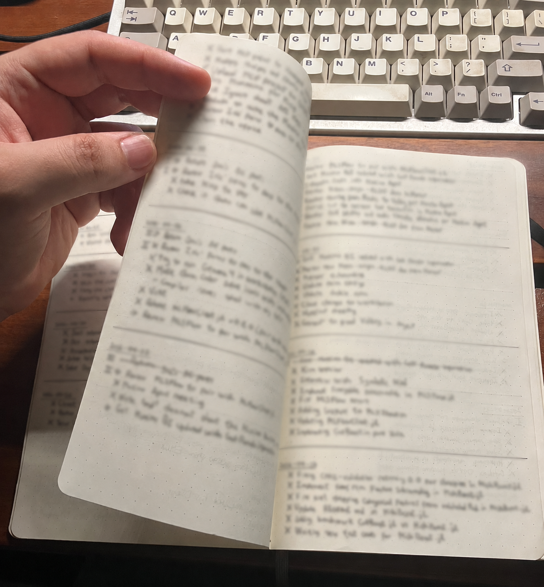

## Introduction
I was always a note-taking person. When I was studying at the university, post-it notes 
were my best friends and the main source of knowledge invading my entire room. Passing 
through the years, I lost the habit while focusing on my professional life, until I touched
the adult life with house responsibilities and a full-time job.

So I started to take notes again, but this time it didn't work at all because the
information was not about knowledge, it was about what I did and what I wanted to do. A
new approach faced with a new problem: I didn't have time to take notes, and I didn't have
time to reflect on my own life. I needed a system that could help me with that but with
minimal time investment.

I remembered that once, when I was a research intern in Binghamton University, my mentor
Gisella Bejarano introduced me to the journaling and how much it improved her academic
life. I never thought about that, and sincerely ignored the idea because my note approach
was working well at that time. So I gave it a try, and I found that it was a great tool to
organize my life. I consider that this is something that made my life more productive, and
giving me the opportunity to look back and reflect about what I was doing and how I thought
or felt about it.

## Concept
A system based on [Bullet Journaling principles](https://bulletjournal.com/blogs/faq/how-to-start-a-bullet-journal-for-beginners),
but adapted to a fast-paced lifestyle with minimal time for planning and reflection.

## Symbols
| Symbol   | Meaning                  |
| -------- | ------------------------ |
| •        | Task                     |
| x        | Completed task           |
| -        | Note                     |
| o        | Event                    |
| =>       | Pass                     |
| <=       | Migrate                  |
| +• task+ | Dismissed task           |
| *        | Priority                 |
| n • task | Task with n-times passes |

## Modules (in implementation order)
### Index (optional)
A module that keeps track of the different modules and their page numbers.

### Migration yard
A module needed to save migrated tasks or events to be scheduled later. Standard
configuration keeps track of a whole year.

### Monthly summary
A module that summarizes each day of the month, completed habits, notes and free-form
thoughts about the month.

### Daily log
The main module of the system, where tasks, events and notes are registered. Each day is a
mirror of the user's life.

## Rules
- A journal starts at least with a migration yard with a time period of your convenience
(standard is one year)
- A monthly summary is created at the start of each month, and a daily log is created at
the start of each day. If tasks are present in the month of the migration yard, they are
migrated to the first daily log of the month
- It's not possible to create future monthly summaries or daily logs. Only the current
month or day can be created
- A daily log can contain tasks, events and notes. It can take a page block, or one or
multiple pages if needed
- Tasks that are not completed at the end of the day are either migrated to the migration
yard or passed to the next day
- Each passed task increases its pass count by one, which is represented before the task
symbol. If a task is passed more than three times, it must be migrated or dismissed

